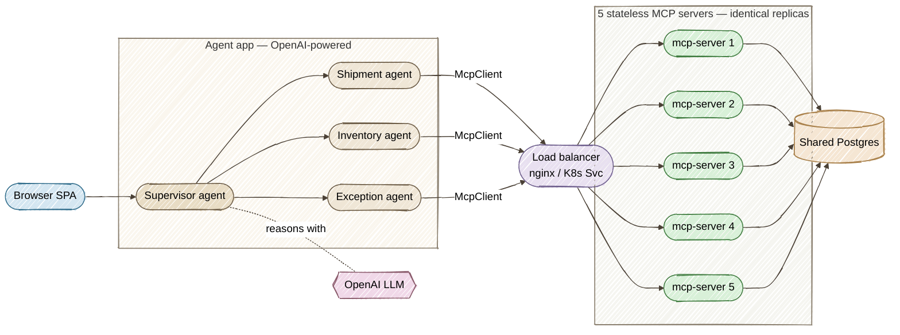
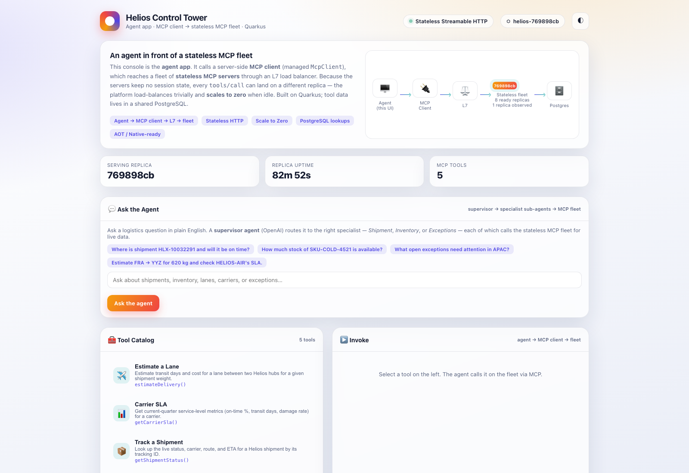
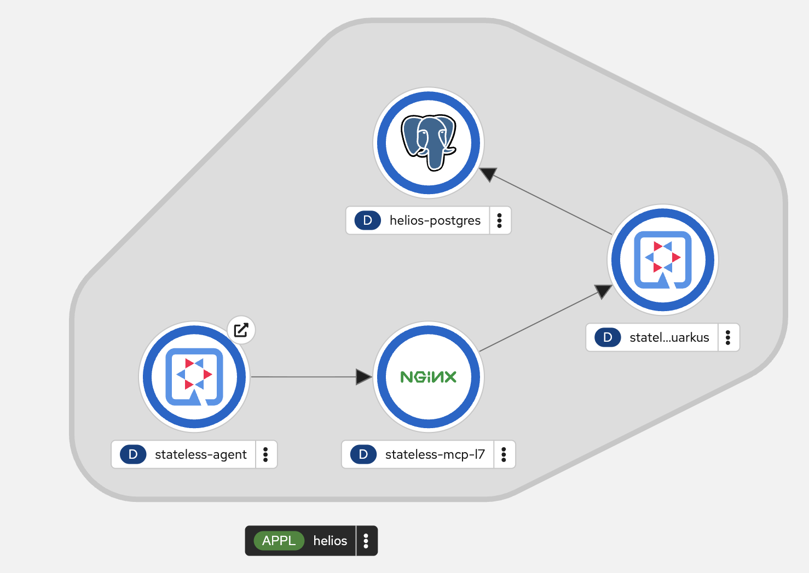
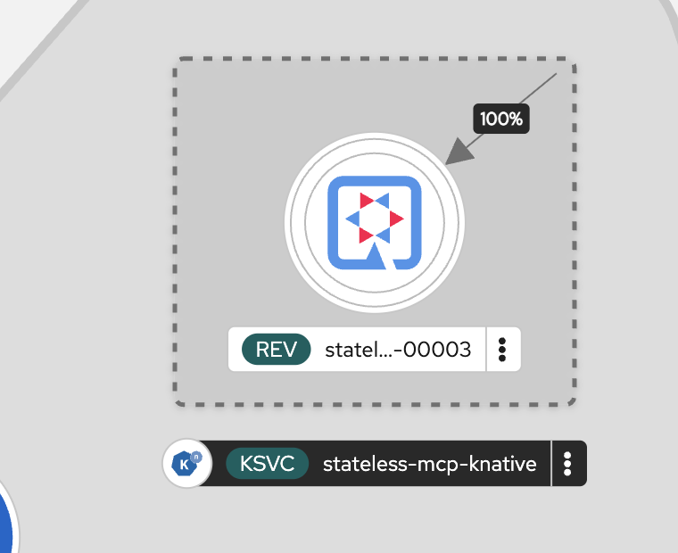

# Helios Control Tower — Agent + Stateless MCP Fleet on Quarkus

[](https://github.com/danieloh30/stateless-mcp-quarkus)
[](https://github.com/danieloh30/stateless-mcp-quarkus/actions)
[](.github/dependabot.yml)
[](.github/workflows/dependabot-auto-merge.yml)

A production-shaped demo of **stateless, cloud-native MCP (Model Context Protocol) servers** on
**Quarkus** / **Java 25**, fronted by a real **agentic** app — an **OpenAI-powered supervisor** that
routes plain-English questions to specialist sub-agents, each backed by the MCP fleet — with a
polished single-page console.

---

## The enterprise scenario

**Helios Logistics** is a fictional global freight company. Its AI agents and ops teams query live
enterprise data — shipment tracking, warehouse inventory, lane pricing, carrier SLAs, open
exceptions. Instead of one stateful, session-heavy server, Helios runs a **fleet of stateless MCP
tool servers**, and a separate **agent** app talks to them:



The two tiers have clean responsibilities:

- **`agent/`** — the front door and the brains. Serves the console SPA and runs a real
  **agentic app**: a **`@SupervisorAgent`** (OpenAI-backed) routes each plain-English question to
  specialist **`@Agent` sub-agents** (shipment, inventory, exceptions), each holding a managed
  **`McpClient`** (`quarkus-langchain4j-mcp`) that speaks MCP to the fleet. The classic
  tool-catalog/invoke REST endpoints still exist for the console's raw "Run 5×" view.
- **`mcp-server/`** — pure MCP tool servers: `@Tool` methods + PostgreSQL lookups, no UI. Run as
  **5 identical stateless replicas** behind the load balancer.

Because the servers keep **zero** in-JVM state (all state lives in Postgres), each `tools/call` can
be served by any replica. The console's **“Run 5×”** shows the serving replica rotating while the
result never changes — real horizontal scaling, and the basis for **scale to zero**.

Statelessness is enabled with `quarkus.mcp.server.http.streamable.auto-init=true`: no `initialize`
handshake or session is required, so there's no affinity to pin a client to one replica.

---

## MCP tools

| Tool | What it does | Example args |
|------|--------------|--------------|
| `getShipmentStatus` | Live status, carrier, route, ETA for a shipment | `HLX-10032291` |
| `getWarehouseInventory` | On-hand / reserved / available stock for a SKU | `SKU-COLD-4521` |
| `estimateDelivery` | Transit days & cost for a lane between two hubs | `FRA → YYZ, 620 kg` |
| `getCarrierSla` | On-time %, transit days, damage rate for a carrier | `HELIOS-AIR` |
| `listOpenExceptions` | Shipments needing operator attention in a region | `APAC` |

Arguments are hardened with Jakarta Bean Validation (`@Pattern`, `@Positive`, `@Size`) — malformed
input is rejected before any DB lookup. (A `getServerInstance` tool also exists, used by the console
to reveal which replica served a request.)

---

## Ask the agent (natural language)

The console's **“💬 Ask the Agent”** card posts a plain-English question to `POST /agent/ask`. The
OpenAI-powered **supervisor** decides which specialist sub-agent(s) to call, each pulls live data
from the stateless MCP fleet, and the supervisor returns a synthesized answer:

```bash
curl -s localhost:8090/agent/ask -H 'content-type: application/json' \
  -d '{"question":"Where is shipment HLX-10032291 and will it arrive on time?"}'
# → {"answer":"HLX-10032291 is in transit with HELIOS-AIR on the FRA→YYZ lane, ETA ..."}
```

Try things like *“How much stock of SKU-COLD-4521 is available?”*, *“Estimate delivery from FRA to
YYZ for 620 kg”*, or *“What exceptions are open in APAC?”* The raw tool-catalog / `Run 5×` view still
lives alongside it for the statelessness demo.

| Sub-agent | Specialty | MCP tools it uses |
|-----------|-----------|-------------------|
| `ShipmentAgent` | Tracking, delivery/lane estimates, carrier SLAs | `getShipmentStatus`, `estimateDelivery`, `getCarrierSla` |
| `InventoryAgent` | Warehouse stock questions | `getWarehouseInventory` |
| `ExceptionAgent` | Shipments needing operator attention | `listOpenExceptions` |

---

## Run it — dev mode (two processes)

Prerequisites: **Java 25+**, the **Quarkus CLI**, **Docker** or **Podman** (for the database), and an
**`OPENAI_API_KEY`** (the agent's supervisor + sub-agents call OpenAI). The model defaults to
`gpt-5.6-sol` and is overridable with **`HELIOS_LLM_MODEL`** (a mini model works fine too).

If the `quarkus` command is not installed, install the CLI with one of these options (see the
[official Quarkus CLI guide](https://quarkus.io/guides/cli-tooling)):

```bash
brew install quarkusio/tap/quarkus  # Homebrew (macOS/Linux)
sdk install quarkus                 # SDKMAN! (macOS/Linux)
jbang app install --fresh --force quarkus@quarkusio  # JBang (cross-platform)
quarkus --version                   # verify
```

```bash
export OPENAI_API_KEY=sk-...          # required for the "Ask the Agent" flow
export HELIOS_LLM_MODEL=gpt-5.6-sol   # optional — defaults to this
```

Run each command **from its module directory**. Starting dev mode inside the module avoids terminal
initialization issues seen when selecting the module from the repository root with `-pl`:

```bash
# Terminal 1 — the MCP server. Dev Services auto-starts a throwaway PostgreSQL
# (seeded from import.sql) and serves MCP on :8080.
cd mcp-server
quarkus dev

# Terminal 2 — the agent (console + supervisor/sub-agents) on :8090, pointing at :8080.
# Open a second terminal at the repository root. Reads OPENAI_API_KEY from your shell.
cd agent
quarkus dev
```

Open the console at **<http://localhost:8090/>**. In dev there is one MCP server, so “Run 5×” shows
a single replica — same stateless guarantee, one server.

Other endpoints: MCP at `http://localhost:8080/mcp`, health at `/q/health` on each app.

## Run it — the cluster (see real statelessness)

Launch the full topology — **agent → LB → 5 stateless MCP replicas → shared Postgres**:

```bash
./start-cluster.sh      # builds both images, starts everything
open http://localhost:8080
# Pick a tool → "Run 5×" → the serving replica rotates across all 5, results identical.
./stop-cluster.sh       # tear down
```

## Package & native

```bash
./mvnw clean package                 # builds both modules
./mvnw clean package -Dnative        # GraalVM native — instant start, tiny memory
```

## Deploy to OpenShift / Kubernetes (native + scale-to-zero)

The `quarkus-openshift` extension generates the application manifests at build time. The **agent**
gets a Route (external); the **MCP servers** stay internal. An internal nginx L7 proxy makes
per-request rotation visible even though an OpenShift Service normally balances per TCP connection.
The SPA reports ready pods separately from replicas observed serving requests, using a headless
discovery Service. The agent finds the proxy at `http://stateless-mcp-l7/mcp` (override with
`MCP_FLEET_URL`), and the datasource comes from
the `helios-db` Secret — no secrets in the image.

### Step 1 — Log in and pick a project

```bash
oc login ...            # cluster-admin (Step 2 installs a cluster-scoped operator)
oc new-project helios
```

### Step 2 — Install OpenShift Serverless (once, for scale-to-zero)

Required only for the Knative scale-to-zero step below. The script installs the operator and enables
Knative Serving, waiting until both are ready:

```bash
./install-serverless.sh   # applies k8s/serverless-operator.yaml + k8s/knative-serving.yaml
```

### Step 3 — Build images and deploy the apps + database

```bash
./deploy-openshift.sh          # JVM images (portable default)
./deploy-openshift.sh native   # optional: requires a matching native-build environment
```

This applies the shared PostgreSQL (`k8s/postgres.yaml`) and deploys both modules. Generated
manifests land in each module's `target/kubernetes/`.

The agent needs its OpenAI key on the cluster — create it as a Secret and expose it to the agent
Deployment as `OPENAI_API_KEY` (never bake it into the image):

```bash
oc create secret generic helios-openai --from-literal=OPENAI_API_KEY="$OPENAI_API_KEY"
oc set env deploy/stateless-agent --from=secret/helios-openai
```

### Step 4 — Scale the stateless fleet

No session affinity, so scaling is just a number:

```bash
oc scale deploy/stateless-mcp-quarkus --replicas=8
```

The SPA shows platform readiness separately from replicas actually observed serving requests:



*Helios Control Tower in fixed-fleet mode with eight ready MCP replicas.*



*OpenShift Developer Topology in regular mode: Agent → nginx L7 proxy → stateless MCP Deployment
→ PostgreSQL.*

### Step 5 — Scale to zero with Knative (the stateless payoff)

Switch the Agent from the fixed Deployment/L7 fleet to a cluster-local Knative Service
(`minScale: 0`) backed by the same MCP image and PostgreSQL database:

```bash
./knative-mode.sh enable
oc get pod -l serving.knative.dev/service=stateless-mcp-knative -w
```

After the last request and Knative's idle window, the MCP pod count falls to zero. The SPA's
three-second readiness check uses a passive headless Service and therefore does not wake it. Invoke
a tool in the SPA to cold-start the MCP server and watch the ready count rise again. A native image
starts faster, but the flow also works with the default portable JVM image. While this mode is
active, the Agent probe checks the Agent itself rather than issuing an MCP discovery request every
ten seconds, and the MCP client's one-minute automatic heartbeat is disabled; otherwise that health
traffic would deliberately keep Knative warm. Passive instance polling is also blocked server-side,
so even a browser tab opened before the mode switch cannot keep the MCP revision running.



*OpenShift Developer Topology groups the Quarkus Revision under its Knative Service; the objects
remain visible even after the revision's pod count reaches zero.*

Return to the regular L7-balanced fleet (restoring its previous replica count) with:

```bash
./knative-mode.sh disable
```

> Demo flow for the talk: **dev (2 processes) → local cluster (`./start-cluster.sh`, 5 replicas
> round-robin) → OpenShift native → Knative scale-to-zero.**

---

## Automated dependency upgrades

- **`.github/dependabot.yml`** — **daily** Maven (`io.quarkus*`, `io.quarkiverse.mcp*`, grouped) and
  GitHub Actions checks.
- **`.github/workflows/dependabot-auto-merge.yml`** — builds/tests each Dependabot PR, then
  **auto-merges** only if it passes.

## Project layout

```
stateless-mcp-quarkus/               (parent / aggregator pom)
├── mcp-server/                      # stateless MCP tool servers (run as 5 replicas)
│   ├── src/main/java/dev/helios/
│   │   ├── tools/ShipmentTools.java #   @Tool methods (+ getServerInstance)
│   │   ├── service/                 #   ShipmentService (Panache) + InstanceInfo
│   │   ├── domain/                  #   JPA entities
│   │   └── model/                   #   response records
│   ├── src/main/resources/          #   application.properties, import.sql
│   ├── src/main/docker/Dockerfile.jvm
│   └── src/test/java/...HeliosMcpTest.java   # tests over /mcp
├── agent/                           # agentic app + console (the front door)
│   ├── src/main/java/dev/helios/agent/
│   │   ├── agents/                  #   @SupervisorAgent + @Agent sub-agents
│   │   │   ├── HeliosSupervisor.java     #     routes NL questions to sub-agents
│   │   │   ├── ShipmentAgent.java        #     shipment / inventory / exception,
│   │   │   ├── InventoryAgent.java       #     each with a @ToolBox
│   │   │   └── ExceptionAgent.java
│   │   ├── tools/                   #   @Tool bridges: sub-agent → MCP fleet
│   │   │   ├── ShipmentToolbox.java
│   │   │   ├── InventoryToolbox.java
│   │   │   └── ExceptionToolbox.java
│   │   ├── service/AgentService.java #   managed McpClient → the fleet
│   │   ├── rest/AgentResource.java  #   REST the SPA calls (/agent/*, /agent/ask)
│   │   └── dto/                     #   AskRequest / AskResult / InvokeResult records
│   ├── src/main/resources/
│   │   ├── application.properties
│   │   └── META-INF/resources/index.html   # the console SPA
│   └── src/main/docker/Dockerfile.jvm
├── compose.yml                      # postgres + 5 mcp replicas + nginx LB + agent
├── compose/ (init.sql, nginx.conf)
├── k8s/
│   ├── postgres.yaml               # shared Postgres (Secret + Deployment + Service)
│   ├── serverless-operator.yaml    # OpenShift Serverless operator (OLM)
│   ├── knative-serving.yaml        # KnativeServing CR (enables scale-to-zero)
│   └── knative-service.yaml        # the MCP fleet as a scale-to-zero Knative Service
├── start-cluster.sh / stop-cluster.sh / knative-mode.sh
├── install-serverless.sh / deploy-openshift.sh
└── .github/                         # Dependabot + build-gated auto-merge
```

Built with [Quarkus](https://quarkus.io), the
[Quarkus MCP Server](https://github.com/quarkiverse/quarkus-mcp-server), and
[Quarkus LangChain4j](https://docs.quarkiverse.io/quarkus-langchain4j/dev/) (agentic `@Agent` /
`@SupervisorAgent` + MCP client, on OpenAI).
