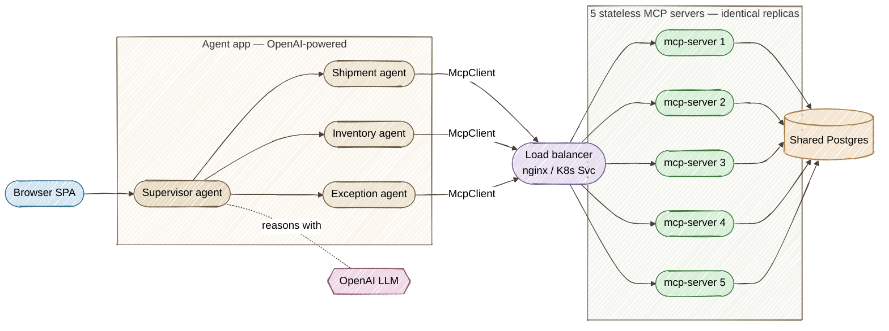

# Helios Control Tower — Agent + Stateless MCP Fleet on Quarkus

[](https://github.com/danieloh30/stateless-mcp-quarkus)
[](https://github.com/danieloh30/stateless-mcp-quarkus/actions)
[](.github/dependabot.yml)
[](.github/workflows/dependabot-auto-merge.yml)

A production-shaped demo of **stateless, cloud-native MCP (Model Context Protocol) servers** on
**Quarkus** / **Java 25**, fronted by a real **agentic** app — an **OpenAI-powered supervisor** that
routes plain-English questions to specialist sub-agents, each backed by the MCP fleet — with a
polished single-page console.

> Companion demo for the talk **“Going Stateless: Scaling MCP Servers to Cloud-Native Java & HTTP”**
> (MCP Dev Summit, Toronto 2026).

---

## The enterprise scenario

**Helios Logistics** is a fictional global freight company. Its AI agents and ops teams query live
enterprise data — shipment tracking, warehouse inventory, lane pricing, carrier SLAs, open
exceptions. Instead of one stateful, session-heavy server, Helios runs a **fleet of stateless MCP
tool servers**, and a separate **agent** app talks to them:



The two tiers have clean responsibilities:

- **`agent/`** — the front door and the brains. Serves the console SPA and runs a real
  **agentic app**: a **`@SupervisorAgent`** (OpenAI-backed) routes each plain-English question to
  specialist **`@Agent` sub-agents** (shipment, inventory, exceptions), each holding a managed
  **`McpClient`** (`quarkus-langchain4j-mcp`) that speaks MCP to the fleet. The classic
  tool-catalog/invoke REST endpoints still exist for the console's raw "Run 5×" view.
- **`mcp-server/`** — pure MCP tool servers: `@Tool` methods + PostgreSQL lookups, no UI. Run as
  **5 identical stateless replicas** behind the load balancer.

Because the servers keep **zero** in-JVM state (all state lives in Postgres), each `tools/call` can
be served by any replica. The console's **“Run 5×”** shows the serving replica rotating while the
result never changes — real horizontal scaling, and the basis for **scale to zero**.

Statelessness is enabled with `quarkus.mcp.server.http.streamable.auto-init=true`: no `initialize`
handshake or session is required, so there's no affinity to pin a client to one replica.

---

## MCP tools

| Tool | What it does | Example args |
|------|--------------|--------------|
| `getShipmentStatus` | Live status, carrier, route, ETA for a shipment | `HLX-10032291` |
| `getWarehouseInventory` | On-hand / reserved / available stock for a SKU | `SKU-COLD-4521` |
| `estimateDelivery` | Transit days & cost for a lane between two hubs | `FRA → YYZ, 620 kg` |
| `getCarrierSla` | On-time %, transit days, damage rate for a carrier | `HELIOS-AIR` |
| `listOpenExceptions` | Shipments needing operator attention in a region | `APAC` |

Arguments are hardened with Jakarta Bean Validation (`@Pattern`, `@Positive`, `@Size`) — malformed
input is rejected before any DB lookup. (A `getServerInstance` tool also exists, used by the console
to reveal which replica served a request.)

---

## Ask the agent (natural language)

The console's **“💬 Ask the Agent”** card posts a plain-English question to `POST /agent/ask`. The
OpenAI-powered **supervisor** decides which specialist sub-agent(s) to call, each pulls live data
from the stateless MCP fleet, and the supervisor returns a synthesized answer:

```bash
curl -s localhost:8090/agent/ask -H 'content-type: application/json' \
  -d '{"question":"Where is shipment HLX-10032291 and will it arrive on time?"}'
# → {"answer":"HLX-10032291 is in transit with HELIOS-AIR on the FRA→YYZ lane, ETA ..."}
```

Try things like *“How much stock of SKU-COLD-4521 is available?”*, *“Estimate delivery from FRA to
YYZ for 620 kg”*, or *“What exceptions are open in APAC?”* The raw tool-catalog / `Run 5×` view still
lives alongside it for the statelessness demo.

| Sub-agent | Specialty | MCP tools it uses |
|-----------|-----------|-------------------|
| `ShipmentAgent` | Tracking, delivery/lane estimates, carrier SLAs | `getShipmentStatus`, `estimateDelivery`, `getCarrierSla` |
| `InventoryAgent` | Warehouse stock questions | `getWarehouseInventory` |
| `ExceptionAgent` | Shipments needing operator attention | `listOpenExceptions` |

---

## Run it — dev mode (two processes)

Prerequisites: **Java 25+**, **Maven 3.9+**, **Docker** or **Podman** (for the database), and an
**`OPENAI_API_KEY`** (the agent's supervisor + sub-agents call OpenAI). The model defaults to
`gpt-5.6-sol` and is overridable with **`HELIOS_LLM_MODEL`** (a mini model works fine too).

```bash
export OPENAI_API_KEY=sk-...          # required for the "Ask the Agent" flow
export HELIOS_LLM_MODEL=gpt-5.6-sol   # optional — defaults to this
```

Run both commands **from the repo root** (the `-pl` module paths resolve against the aggregator
`pom.xml` there):

```bash
# Terminal 1 — the MCP server. Dev Services auto-starts a throwaway PostgreSQL
# (seeded from import.sql) and serves MCP on :8080.
mvn -pl mcp-server quarkus:dev

# Terminal 2 — the agent (console + supervisor/sub-agents) on :8090, pointing at :8080.
# Reads OPENAI_API_KEY from your shell.
mvn -pl agent quarkus:dev
```

Open the console at **<http://localhost:8090/>**. In dev there is one MCP server, so “Run 5×” shows
a single replica — same stateless guarantee, one server.

Other endpoints: MCP at `http://localhost:8080/mcp`, health at `/q/health` on each app.

## Run it — the cluster (see real statelessness)

Launch the full topology — **agent → LB → 5 stateless MCP replicas → shared Postgres**:

```bash
./start-cluster.sh      # builds both images, starts everything
open http://localhost:8080
# Pick a tool → "Run 5×" → the serving replica rotates across all 5, results identical.
./stop-cluster.sh       # tear down
```

## Package & native

```bash
mvn clean package                    # builds both modules
mvn clean package -Dnative           # GraalVM native — instant start, tiny memory
```

## Deploy to OpenShift / Kubernetes (native + scale-to-zero)

The `quarkus-openshift` extension generates the manifests at build time. The **agent** gets a Route
(external); the **MCP servers** stay internal behind a ClusterIP Service that round-robins across
replicas — no nginx needed on the cluster. The agent finds the fleet at
`http://stateless-mcp-server:8080/mcp` (override with `MCP_FLEET_URL`), and the datasource comes from
the `helios-db` Secret — no secrets in the image.

### Step 1 — Log in and pick a project

```bash
oc login ...            # cluster-admin (Step 2 installs a cluster-scoped operator)
oc new-project helios
```

### Step 2 — Install OpenShift Serverless (once, for scale-to-zero)

Required only for the Knative scale-to-zero step below. The script installs the operator and enables
Knative Serving, waiting until both are ready:

```bash
./install-serverless.sh   # applies k8s/serverless-operator.yaml + k8s/knative-serving.yaml
```

### Step 3 — Build native images and deploy the apps + database

```bash
./deploy-openshift.sh     # native images; or: ./deploy-openshift.sh jvm  (faster build)
```

This applies the shared PostgreSQL (`k8s/postgres.yaml`) and deploys both modules. Generated
manifests land in each module's `target/kubernetes/`.

The agent needs its OpenAI key on the cluster — create it as a Secret and expose it to the agent
Deployment as `OPENAI_API_KEY` (never bake it into the image):

```bash
oc create secret generic helios-openai --from-literal=OPENAI_API_KEY="$OPENAI_API_KEY"
oc set env deploy/agent --from=secret/helios-openai
```

### Step 4 — Scale the stateless fleet

No session affinity, so scaling is just a number:

```bash
oc scale deploy/stateless-mcp-server --replicas=8
```

### Step 5 — Scale to zero with Knative (the stateless payoff)

A native image cold-starts in tens of milliseconds, so running **zero** replicas when idle is
practical. Run the MCP fleet as a Knative Service (`minScale: 0`):

```bash
oc apply -f k8s/postgres.yaml
oc apply -f k8s/knative-service.yaml
```

> Demo flow for the talk: **dev (2 processes) → local cluster (`./start-cluster.sh`, 5 replicas
> round-robin) → OpenShift native → Knative scale-to-zero.**

---

## Automated dependency upgrades

- **`.github/dependabot.yml`** — **daily** Maven (`io.quarkus*`, `io.quarkiverse.mcp*`, grouped) and
  GitHub Actions checks.
- **`.github/workflows/dependabot-auto-merge.yml`** — builds/tests each Dependabot PR, then
  **auto-merges** only if it passes.

## Project layout

```
stateless-mcp-quarkus/               (parent / aggregator pom)
├── mcp-server/                      # stateless MCP tool servers (run as 5 replicas)
│   ├── src/main/java/dev/helios/
│   │   ├── tools/ShipmentTools.java #   @Tool methods (+ getServerInstance)
│   │   ├── service/                 #   ShipmentService (Panache) + InstanceInfo
│   │   ├── domain/                  #   JPA entities
│   │   └── model/                   #   response records
│   ├── src/main/resources/          #   application.properties, import.sql
│   ├── src/main/docker/Dockerfile.jvm
│   └── src/test/java/...HeliosMcpTest.java   # tests over /mcp
├── agent/                           # agentic app + console (the front door)
│   ├── src/main/java/dev/helios/agent/
│   │   ├── agents/                  #   @SupervisorAgent + @Agent sub-agents
│   │   │   ├── HeliosSupervisor.java     #     routes NL questions to sub-agents
│   │   │   ├── ShipmentAgent.java        #     shipment / inventory / exception,
│   │   │   ├── InventoryAgent.java       #     each with a @ToolBox
│   │   │   └── ExceptionAgent.java
│   │   ├── tools/                   #   @Tool bridges: sub-agent → MCP fleet
│   │   │   ├── ShipmentToolbox.java
│   │   │   ├── InventoryToolbox.java
│   │   │   └── ExceptionToolbox.java
│   │   ├── service/AgentService.java #   managed McpClient → the fleet
│   │   ├── rest/AgentResource.java  #   REST the SPA calls (/agent/*, /agent/ask)
│   │   └── dto/                     #   AskRequest / AskResult / InvokeResult records
│   ├── src/main/resources/
│   │   ├── application.properties
│   │   └── META-INF/resources/index.html   # the console SPA
│   └── src/main/docker/Dockerfile.jvm
├── compose.yml                      # postgres + 5 mcp replicas + nginx LB + agent
├── compose/ (init.sql, nginx.conf)
├── k8s/
│   ├── postgres.yaml               # shared Postgres (Secret + Deployment + Service)
│   ├── serverless-operator.yaml    # OpenShift Serverless operator (OLM)
│   ├── knative-serving.yaml        # KnativeServing CR (enables scale-to-zero)
│   └── knative-service.yaml        # the MCP fleet as a scale-to-zero Knative Service
├── start-cluster.sh / stop-cluster.sh
├── install-serverless.sh / deploy-openshift.sh
└── .github/                         # Dependabot + build-gated auto-merge
```

Built with [Quarkus](https://quarkus.io), the
[Quarkus MCP Server](https://github.com/quarkiverse/quarkus-mcp-server), and
[Quarkus LangChain4j](https://docs.quarkiverse.io/quarkus-langchain4j/dev/) (agentic `@Agent` /
`@SupervisorAgent` + MCP client, on OpenAI).
