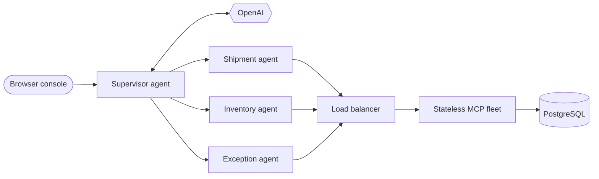

# Architecture

Helios separates reasoning from tool execution. The agent tier owns conversation and delegation; the MCP tier owns validated access to enterprise data.

## Request lifecycle

1. A user asks a plain-English question in the console.
2. The OpenAI-backed supervisor selects the right specialist.
3. That specialist sees only its scoped MCP tools through a `@ToolBox` bridge.
4. The managed MCP client sends a Streamable HTTP request through the load balancer.
5. Any healthy replica validates the input, queries PostgreSQL, and returns the result.

## Specialist boundaries

| Specialist | Responsibility | Available MCP tools |
| --- | --- | --- |
| Shipment | Tracking, lane estimates, carrier SLAs | `getShipmentStatus`, `estimateDelivery`, `getCarrierSla` |
| Inventory | Warehouse stock | `getWarehouseInventory` |
| Exception | Operator attention queues | `listOpenExceptions` |

The explicit toolbox bridges are intentional. Giving every specialist the entire remote catalog would be shorter, but it would also widen each agent's authority.

## Why stateless MCP matters

With `quarkus.mcp.server.http.streamable.auto-init=true`, a request needs no initialization handshake or sticky session. All durable state lives in PostgreSQL, allowing:

- per-request load balancing;
- simple horizontal scaling;
- safe replica replacement;
- scale-to-zero without losing session state.

## Tool boundary

Every tool uses Jakarta Bean Validation before database access. Invalid identifiers, sizes, or values fail at the boundary rather than leaking into business logic.

The transport also derives standard `Mcp-Method` and `Mcp-Name` headers from each JSON-RPC request, giving gateways enough context for method- and tool-aware routing or policy.
